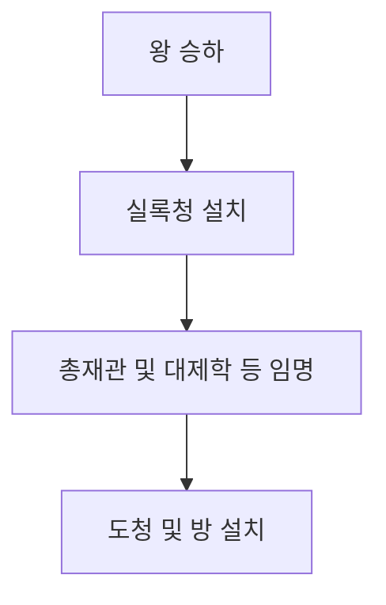
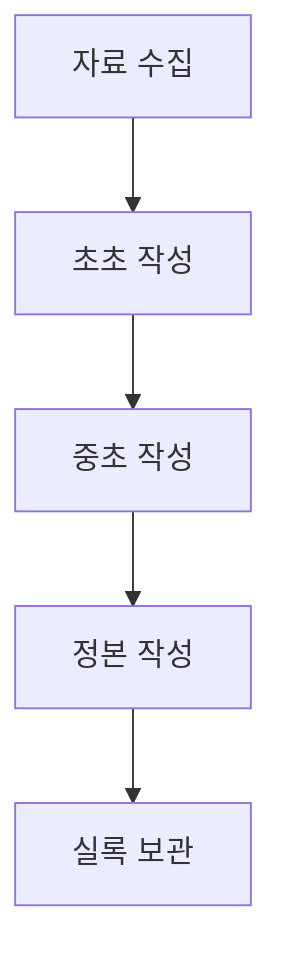

---

### 연결문서
- 

### 메모
옥탑방의 문제아들에서 전한길이 조선왕조실록하는데 문득 제텔카스텐 기법과 비슷한거같아서 조선왕조실록 기록방법을 찾아보았습니다.

#### 편찬 과정

1. 왕 승하: 왕이 사망하면 실록 편찬 과정이 시작됩니다.
2. 실록청 설치: 왕이 승하한 후 임시 관청인 실록청이 설치됩니다.
3. 총재관 및 대제학 등 임명: 실록청의 운영을 위해 총재관과 대제학 등 글에 뛰어난 사람들을 당상과 낭청에 임명합니다.
4. 도청 및 방 설치: 실록 편찬을 위한 도청과 방이 설치됩니다.

5. 자료 수집: 승정원일기와 춘추관에 수집된 사초(史草), 각 기관의 겸임사관들이 생산한 기록들을 수집합니다.
6. 초초(初草) 작성: 수집된 자료를 기반으로 초초를 작성합니다.
7. 중초(中草) 작성: 초초를 기반으로 중초를 작성합니다.
8. 정본(正本) 작성: 중초를 기반으로 최종적으로 정본을 작성합니다.
9. 실록 보관: 편찬된 실록은 춘추관과 지방의 외사고(外史庫)에 보관됩니다.

#### 편찬 체제와 기술[^1]
1. **편성 체제**: 실록은 주로 1년치 기사를 한 권으로 편성했지만, 경우에 따라 6개월, 2개월, 1개월 단위로 편성하기도 했습니다. 
2. **인물 정보**: 각 실록의 시작 부분에는 해당 왕의 기본 정보가 간략히 기록되어 있습니다. 
3. **편찬 체제**: 본문은 연월일 순서대로 기사와 사론을 서술하는 형식을 취하며, 비판적인 시각과 사관이 가미된 역사서입니다. 
4. **기술 방법**: 각 권의 시작 부분에는 권수를 표기하고, 본문은 연월일 순서로 기록됩니다. 
5. **본문 기술**: 본문은 큰 글씨로 쓰이며, 왕이나 선왕의 어휘나 행위를 뜻하는 용어 앞에는 한자를 띄어서 씁니다. 
6. **부록 기록**: 왕의 사망으로 실록이 끝난 후에는 전기류 자료를 부록으로 기록합니다. 
7. . **찬수범례**: 실록에 기록되는 내용의 원칙은 찬수범례로 정해졌으며, 여러 가지 자료를 참고하여 수록합니다. 
 이렇게 편찬 체제와 기술이 체계적으로 이루어져 있어 조선왕조 실록은 역사적 가치가 높은 자료로 인정받고 있습니다.

#### 태백산사고본과 국평영인본
**태백산사고본(太白山史庫本)** 은 조선왕조실록 중 하나로, 조선 태조부터 철종까지의 역사를 기록한 실록을 보관하던 사고(史庫) 중 하나인 태백산사고에 보관되었던 본입니다. 이는 대한민국의 국보 제151-2호로 지정되어 있으며, 현재는 부산광역시 연제구 국가기록원 역사기록관에 소장되어 있습니다.

**국편영인본(國編影印本)** 은 조선왕조실록을 국가 차원에서 편찬하고 영인(影印, 복사)하여 출판한 본을 말합니다. 이는 원본 실록의 내용을 보존하고 널리 보급하기 위해 만들어진 것으로, 연구자들이나 일반인들이 쉽게 접근할 수 있도록 한국어로 번역된 형태로 제공됩니다. 실록의 내용을 검색하거나 참조할 때 자주 사용되는 자료입니다.

#### 조선왕조실록 보기
조선왕조실록은 조선시대 왕들의 행정과 업적을 기록한 역사서로, 각 왕의 실록은 별도의 권으로 나뉘어져 있습니다. 예를 들어, 세종대왕의 경우 '세종실록'이라는 이름으로 기록되어 있습니다.
각 권은 표지와 목록으로 구성되어 있으며, 본문은 한자로 길게 서술되어 있습니다. 다행히도, 국역(국어 번역)과 원문, 그리고 원문 이미지를 통해 내용을 이해할 수 있습니다. 이는 과학적이며 체계적인 방법으로 정보를 제공해줍니다.
본문 내용은 동그라미 기호를 통해 문장을 구분하고 있습니다.

예를 들어 "○還給金聽、崔興孝、羅有綬、閔寅、朴幹職牒." 이런 식으로 기록되어 있습니다.또한, 본문 아래에는 이와 같은 정보가 제공됩니다.

- 【태백산사고본】 4책 10권 19장 A면 
-  【국편영인본】 2책 418면 
-  【분류】 인사-관리(管理)

 이 정보는 조선왕조실록을 내용별, 위치별로 쉽게 찾을 수 있도록 도와주는 역할을 합니다. 이는 현대의 연구자나 사용자들이 실록을 보다 편리하게 이용할 수 있도록 만든 것으로, 실록을 정리한 현대인들이 추가한 정보입니다. 따라서 이 부분은 원래의 조선왕조실록에 포함되어 있던 내용이 아닙니다.

#### 결론
편찬 기술 보니까 메타데이터, Heading 시스템 등 몇몇개가 생각납니다. 그 당시에도 체계화 된 기록을 만들기 위해 얼마나 많은 사람들이 머리를 싸맸을지, 대단합니다.

### 참조
- [기록이야기 008. 조선왕조실록의 편찬과정 : 네이버 블로그 (naver.com)](https://blog.naver.com/PostView.naver?blogId=meetingrooom&logNo=220166077869)
- [실록은 누가 기록했을까 | 실록의 어제와 오늘 | 조선왕조실록의 어제와 오늘 | 국가기록원 (archives.go.kr)](https://www.archives.go.kr/theme/next/sillok/sub2_2.do)
- [조선왕조실록, 그 편찬과 보관 과정!(사초/시정기/실록청의궤/포쇄) : 네이버 블로그 (naver.com)](https://blog.naver.com/PostView.nhn?blogId=sunny87k&logNo=222223700904)
- [^1]: https://sillok.history.go.kr/intro/intro.do